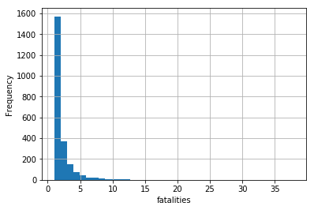
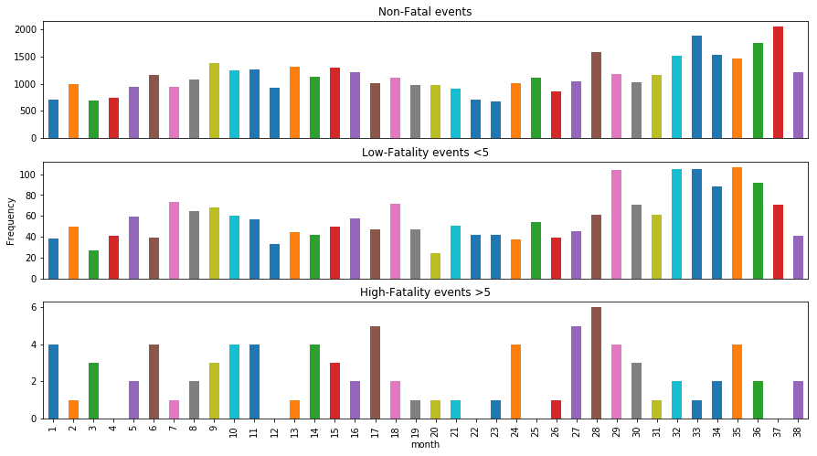
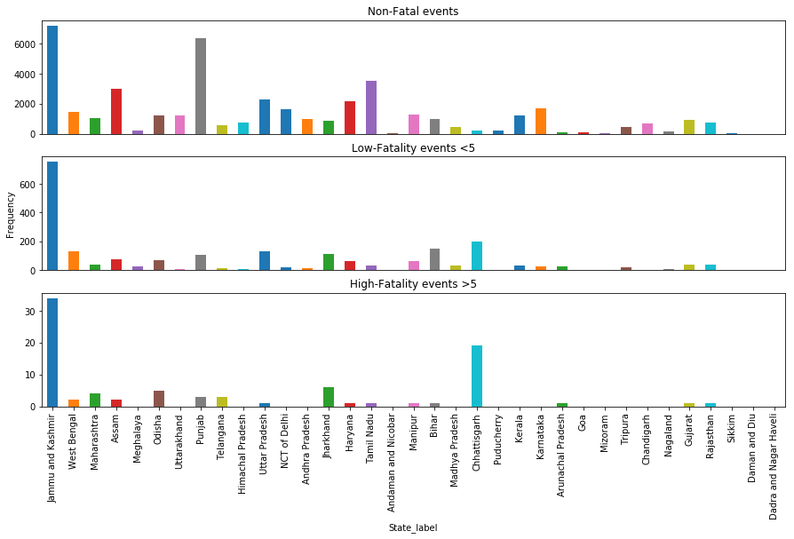
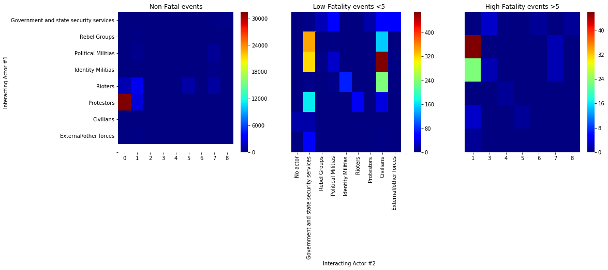
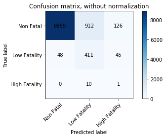
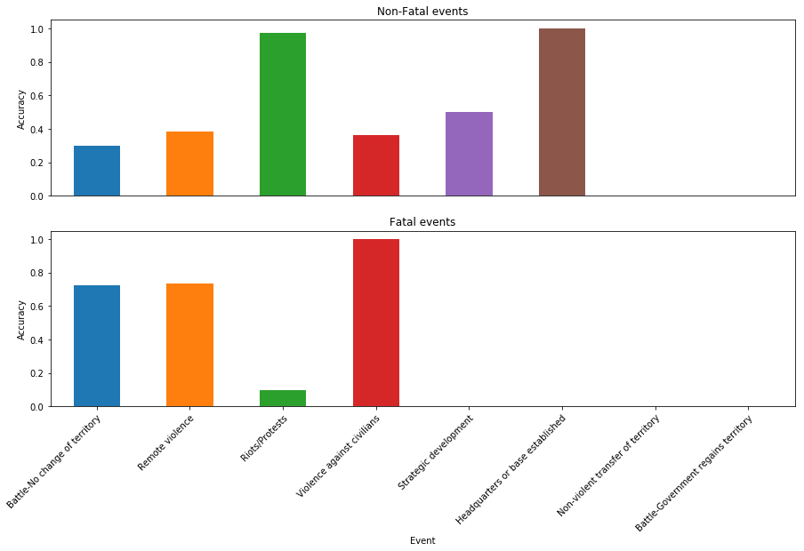

```python
#The Armed Conflict Location & Event Data Project (ACLED) is a disaggregated conflict collection, analysis and crisis
#mapping project.
#ACLED collects the dates, actors, types of violence, locations, and fatalities of all reported political violence 
#and protest events.
#Political violence and protest includes events that occur within civil wars and periods of instability, public protest 
#and regime breakdown.
# Data collected from India during the period of 26-January-2016 to 26-January-2019
#source: https://www.acleddata.com/data/
#Raleigh, Clionadh, Andrew Linke, Håvard Hegre and Joakim Karlsen. (2010).
#“Introducing ACLED-Armed Conflict Location and Event Data.” Journal of Peace
#Research 47(5) 651-660.
```


```python
import numpy as np
import pandas as pd
from datetime import datetime, timedelta
from scipy import stats
import matplotlib.pyplot as plt
import seaborn as sns
%matplotlib inline
```


```python
# Although it is not advisable but to keep this notebook clean and short, supress warnings 
# comment this when you want to see warnings
import warnings
warnings.filterwarnings("ignore")
```


```python
# machine learning
from sklearn.linear_model import LogisticRegression
from sklearn.svm import SVC, LinearSVC
from sklearn.ensemble import RandomForestClassifier
from sklearn.neighbors import KNeighborsClassifier
from sklearn.naive_bayes import GaussianNB
from sklearn.linear_model import Perceptron
from sklearn.linear_model import SGDClassifier
from sklearn.tree import DecisionTreeClassifier
from sklearn.ensemble import AdaBoostClassifier
from sklearn.metrics import mean_squared_error
from sklearn.metrics import accuracy_score
from xgboost import XGBClassifier
```


```python
pd.set_option('display.max_columns', 50)
```


```python
# Loading protest and political violence data
#data=pd.read_csv('ACLED_data_India.csv')
data=pd.read_csv('ACLED_data_India_updated.csv')
# load codes description data
inter_codes=pd.read_csv('Inter_codes.csv')
geo_precision_codes=pd.read_csv('geo_precision_code.csv')
time_precision_codes=pd.read_csv('time_precision_code.csv')
```


```python
data.head()
```


<div>
<style scoped>
    .dataframe tbody tr th:only-of-type {
        vertical-align: middle;
    }

    .dataframe tbody tr th {
        vertical-align: top;
    }

    .dataframe thead th {
        text-align: right;
    }
</style>
<table border="1" class="dataframe">
  <thead>
    <tr style="text-align: right;">
      <th></th>
      <th>data_id</th>
      <th>iso</th>
      <th>event_id_cnty</th>
      <th>event_id_no_cnty</th>
      <th>event_date</th>
      <th>year</th>
      <th>time_precision</th>
      <th>event_type</th>
      <th>actor1</th>
      <th>assoc_actor_1</th>
      <th>inter1</th>
      <th>actor2</th>
      <th>assoc_actor_2</th>
      <th>inter2</th>
      <th>interaction</th>
      <th>region</th>
      <th>country</th>
      <th>admin1</th>
      <th>admin2</th>
      <th>admin3</th>
      <th>location</th>
      <th>latitude</th>
      <th>longitude</th>
      <th>geo_precision</th>
      <th>source</th>
      <th>source_scale</th>
      <th>notes</th>
      <th>fatalities</th>
      <th>timestamp</th>
      <th>iso3</th>
    </tr>
  </thead>
  <tbody>
    <tr>
      <th>0</th>
      <td>3090605</td>
      <td>356</td>
      <td>IND46153</td>
      <td>46153</td>
      <td>16-Feb-19</td>
      <td>2019</td>
      <td>1</td>
      <td>Battle-No change of territory</td>
      <td>Military Forces of India (2014-)</td>
      <td>Police Forces of India (2014-) Border Security...</td>
      <td>1</td>
      <td>Military Forces of Pakistan (2018-)</td>
      <td>NaN</td>
      <td>8</td>
      <td>18</td>
      <td>Southern Asia</td>
      <td>India</td>
      <td>Jammu and Kashmir</td>
      <td>Rajouri</td>
      <td>Naushera</td>
      <td>Kalal</td>
      <td>33.3418</td>
      <td>74.3889</td>
      <td>2</td>
      <td>Chandigarh Tribune</td>
      <td>Subnational</td>
      <td>On 16 Feb, Indian and Pakistani forces exchang...</td>
      <td>0</td>
      <td>1550588555</td>
      <td>IND</td>
    </tr>
    <tr>
      <th>1</th>
      <td>3090606</td>
      <td>356</td>
      <td>IND46154</td>
      <td>46154</td>
      <td>16-Feb-19</td>
      <td>2019</td>
      <td>1</td>
      <td>Remote violence</td>
      <td>Unidentified Armed Group (India)</td>
      <td>NaN</td>
      <td>3</td>
      <td>Military Forces of India (2014-)</td>
      <td>NaN</td>
      <td>1</td>
      <td>13</td>
      <td>Southern Asia</td>
      <td>India</td>
      <td>Jammu and Kashmir</td>
      <td>Rajouri</td>
      <td>Naushera</td>
      <td>Jhangar Dharmsal</td>
      <td>33.2705</td>
      <td>74.0508</td>
      <td>2</td>
      <td>Chandigarh Tribune; Daily Excelsior</td>
      <td>Subnational</td>
      <td>On 16 Feb, an Indian army officer was killed a...</td>
      <td>1</td>
      <td>1550588555</td>
      <td>IND</td>
    </tr>
    <tr>
      <th>2</th>
      <td>3090607</td>
      <td>356</td>
      <td>IND46155</td>
      <td>46155</td>
      <td>16-Feb-19</td>
      <td>2019</td>
      <td>1</td>
      <td>Riots/Protests</td>
      <td>Rioters (India)</td>
      <td>NaN</td>
      <td>5</td>
      <td>NaN</td>
      <td>NaN</td>
      <td>0</td>
      <td>50</td>
      <td>Southern Asia</td>
      <td>India</td>
      <td>Jammu and Kashmir</td>
      <td>Samba</td>
      <td>Samba</td>
      <td>Samba</td>
      <td>32.5625</td>
      <td>75.1199</td>
      <td>2</td>
      <td>Daily Excelsior</td>
      <td>subnational</td>
      <td>On 16 Feb, people held demonstrations and burn...</td>
      <td>0</td>
      <td>1550588555</td>
      <td>IND</td>
    </tr>
    <tr>
      <th>3</th>
      <td>3090608</td>
      <td>356</td>
      <td>IND46156</td>
      <td>46156</td>
      <td>16-Feb-19</td>
      <td>2019</td>
      <td>1</td>
      <td>Riots/Protests</td>
      <td>Rioters (India)</td>
      <td>NaN</td>
      <td>5</td>
      <td>NaN</td>
      <td>NaN</td>
      <td>0</td>
      <td>50</td>
      <td>Southern Asia</td>
      <td>India</td>
      <td>Jammu and Kashmir</td>
      <td>Reasi</td>
      <td>Reasi</td>
      <td>Reasi</td>
      <td>33.0792</td>
      <td>74.8342</td>
      <td>2</td>
      <td>Daily Excelsior</td>
      <td>subnational</td>
      <td>On 16 Feb, people held demonstrations and burn...</td>
      <td>0</td>
      <td>1550588555</td>
      <td>IND</td>
    </tr>
    <tr>
      <th>4</th>
      <td>3090609</td>
      <td>356</td>
      <td>IND46157</td>
      <td>46157</td>
      <td>16-Feb-19</td>
      <td>2019</td>
      <td>1</td>
      <td>Riots/Protests</td>
      <td>Rioters (India)</td>
      <td>BJP: Bharatiya Janata Party</td>
      <td>5</td>
      <td>Police Forces of India (2014-)</td>
      <td>Civilians (India); TMC: Trinamool Congress Par...</td>
      <td>1</td>
      <td>15</td>
      <td>Southern Asia</td>
      <td>India</td>
      <td>West Bengal</td>
      <td>Birbhum</td>
      <td>Labhpur</td>
      <td>Labhpur</td>
      <td>23.8160</td>
      <td>87.7982</td>
      <td>1</td>
      <td>India Blooms News Service</td>
      <td>National</td>
      <td>On February 16, locals attacked a TMC MLA and ...</td>
      <td>0</td>
      <td>1550588555</td>
      <td>IND</td>
    </tr>
  </tbody>
</table>
</div>


```python
inter_codes
```


<div>
<style scoped>
    .dataframe tbody tr th:only-of-type {
        vertical-align: middle;
    }

    .dataframe tbody tr th {
        vertical-align: top;
    }

    .dataframe thead th {
        text-align: right;
    }
</style>
<table border="1" class="dataframe">
  <thead>
    <tr style="text-align: right;">
      <th></th>
      <th>inter_code</th>
      <th>description</th>
    </tr>
  </thead>
  <tbody>
    <tr>
      <th>0</th>
      <td>0</td>
      <td>No actor</td>
    </tr>
    <tr>
      <th>1</th>
      <td>1</td>
      <td>Government and state security services</td>
    </tr>
    <tr>
      <th>2</th>
      <td>2</td>
      <td>Rebel Groups</td>
    </tr>
    <tr>
      <th>3</th>
      <td>3</td>
      <td>Political Militias</td>
    </tr>
    <tr>
      <th>4</th>
      <td>4</td>
      <td>Identity Militias</td>
    </tr>
    <tr>
      <th>5</th>
      <td>5</td>
      <td>Rioters</td>
    </tr>
    <tr>
      <th>6</th>
      <td>6</td>
      <td>Protestors</td>
    </tr>
    <tr>
      <th>7</th>
      <td>7</td>
      <td>Civilians</td>
    </tr>
    <tr>
      <th>8</th>
      <td>8</td>
      <td>External/other forces</td>
    </tr>
  </tbody>
</table>
</div>


```python
geo_precision_codes
```


<div>
<style scoped>
    .dataframe tbody tr th:only-of-type {
        vertical-align: middle;
    }

    .dataframe tbody tr th {
        vertical-align: top;
    }

    .dataframe thead th {
        text-align: right;
    }
</style>
<table border="1" class="dataframe">
  <thead>
    <tr style="text-align: right;">
      <th></th>
      <th>geo_precision_code</th>
      <th>precision_level</th>
    </tr>
  </thead>
  <tbody>
    <tr>
      <th>0</th>
      <td>1</td>
      <td>highest (exact location)</td>
    </tr>
    <tr>
      <th>1</th>
      <td>2</td>
      <td>intermediate (regional)</td>
    </tr>
    <tr>
      <th>2</th>
      <td>3</td>
      <td>lowest (provincial)</td>
    </tr>
  </tbody>
</table>
</div>


```python
time_precision_codes
```


<div>
<style scoped>
    .dataframe tbody tr th:only-of-type {
        vertical-align: middle;
    }

    .dataframe tbody tr th {
        vertical-align: top;
    }

    .dataframe thead th {
        text-align: right;
    }
</style>
<table border="1" class="dataframe">
  <thead>
    <tr style="text-align: right;">
      <th></th>
      <th>time_precision_code</th>
      <th>precision_level</th>
    </tr>
  </thead>
  <tbody>
    <tr>
      <th>0</th>
      <td>1</td>
      <td>highest (day)</td>
    </tr>
    <tr>
      <th>1</th>
      <td>2</td>
      <td>intermediate (week)</td>
    </tr>
    <tr>
      <th>2</th>
      <td>3</td>
      <td>lowest (month)</td>
    </tr>
  </tbody>
</table>
</div>


```python
data.info()
```

    <class 'pandas.core.frame.DataFrame'>
    RangeIndex: 46135 entries, 0 to 46134
    Data columns (total 30 columns):
    data_id             46135 non-null int64
    iso                 46135 non-null int64
    event_id_cnty       46135 non-null object
    event_id_no_cnty    46135 non-null int64
    event_date          46135 non-null object
    year                46135 non-null int64
    time_precision      46135 non-null int64
    event_type          46135 non-null object
    actor1              46135 non-null object
    assoc_actor_1       29511 non-null object
    inter1              46135 non-null int64
    actor2              12993 non-null object
    assoc_actor_2       3627 non-null object
    inter2              46135 non-null int64
    interaction         46135 non-null int64
    region              46135 non-null object
    country             46135 non-null object
    admin1              46135 non-null object
    admin2              46124 non-null object
    admin3              44509 non-null object
    location            46135 non-null object
    latitude            46135 non-null float64
    longitude           46135 non-null float64
    geo_precision       46135 non-null int64
    source              46135 non-null object
    source_scale        46058 non-null object
    notes               46135 non-null object
    fatalities          46135 non-null int64
    timestamp           46135 non-null int64
    iso3                46135 non-null object
    dtypes: float64(2), int64(11), object(17)
    memory usage: 10.6+ MB
    


```python
# Looking at number of unique elements in each column
unique_count=pd.Series()
for column in data.columns:
    unique_count[column]=data[column].unique().size
unique_count
```


    data_id             46135
    iso                     1
    event_id_cnty       46135
    event_id_no_cnty    46135
    event_date           1143
    year                    4
    time_precision          3
    event_type              8
    actor1                503
    assoc_actor_1        1338
    inter1                  8
    actor2                257
    assoc_actor_2         396
    inter2                  9
    interaction            40
    region                  1
    country                 2
    admin1                 35
    admin2                718
    admin3               2865
    location             6513
    latitude             6652
    longitude            6593
    geo_precision           4
    source                788
    source_scale           19
    notes               44657
    fatalities             23
    timestamp             162
    iso3                    1
    dtype: int64


```python
# Cleaning data
# Dropping columns with only one kind to data entry
for column in unique_count.index:
    if unique_count[column]==1:
        data.drop(columns=column,inplace=True)
# Dropping columns with non-relavant information
features_to_drop=['country','data_id','event_id_cnty','event_id_no_cnty','timestamp','year','interaction']
Data1=data.drop(columns=features_to_drop)
# Changing date column to datetime format
Data1['event_date_formatted']=pd.to_datetime(Data1['event_date'])
Data1.drop(columns='event_date',inplace=True)
# Dropping other columns with information not useful for current analysis
Data1.drop(columns=['location','notes','latitude','longitude','admin2','admin3'],inplace=True)
```


```python
# Columns and number of entries with NULL entries
data.isnull().sum()[data.isnull().sum()>0]
```


    assoc_actor_1    16624
    actor2           33142
    assoc_actor_2    42508
    admin2              11
    admin3            1626
    source_scale        77
    dtype: int64


```python
# Fixing the NULL data in column source_scale
# Since source_scale is related to source of the news, so we find the source that has maximum count
# for that type of source_scale and fill the NULL entry with that
Source_missing_scale=Data1['source'][Data1.source_scale.isnull()].unique()
Source_missing_scale_filllist=pd.Series()
for source_name in Source_missing_scale:
    Source_missing_scale_filllist[source_name]=Data1[Data1['source']==source_name]['source_scale'].dropna().value_counts()
Source_missing_scale_filllist
```


    Telegraph (India)                   National    208
    Name: source_scale, dtype: int64
    Sangai Express (India)             Subnational    126
    National         1
    Name: so...
    Times of India                     National       759
    Subnational      2
    Name: so...
    Asian News International           Regional         79
    International     8
    Nation...
    Chandigarh Tribune                 Subnational    710
    National       153
    Name: so...
    Indian Express                     National       1274
    regional          1
    Subnat...
    Pioneer (India)                    National       26
    Subnational     1
    Name: sour...
    Hindustan Times (India)            National       273
    Subnational      1
    Name: so...
    Pioneer (India); Times of India       National    1
    Name: source_scale, dtype: int64
    dtype: object


```python
Data1.replace('regional','Regional',inplace=True) 
for source_item,source_scale_item in zip(Source_missing_scale_filllist.index,Source_missing_scale_filllist):
    Index_of_NaN=Data1.loc[Data1['source']==source_item][Data1.source_scale.isnull()].index
    Data1.loc[Index_of_NaN,'source_scale']=Source_missing_scale_filllist[source_item].idxmax()
```


```python
# We will combine the actor1, actor2, associate actor1 and associate actor2 into one column 
Actors=pd.Series(index=Data1.index)
Actor2_null_imask=Data1.actor2.notnull()
AssoActor1_null_imask=Data1.assoc_actor_1.notnull()
AssoActor2_null_imask=Data1.assoc_actor_2.notnull()
for idx in Data1.index:
    if Actor2_null_imask[idx] and AssoActor1_null_imask[idx] and AssoActor2_null_imask[idx]:
        Actors[idx]=[Data1.loc[idx,'actor1'],Data1.loc[idx,'actor2'],Data1.loc[idx,'assoc_actor_1'],Data1.loc[idx,'assoc_actor_2']]
    elif Actor2_null_imask[idx] and AssoActor1_null_imask[idx] and not AssoActor2_null_imask[idx]:
        Actors[idx]=[Data1.loc[idx,'actor1'],Data1.loc[idx,'actor2'],Data1.loc[idx,'assoc_actor_1']]
    elif Actor2_null_imask[idx] and not AssoActor1_null_imask[idx] and AssoActor2_null_imask[idx]:
        Actors[idx]=[Data1.loc[idx,'actor1'],Data1.loc[idx,'actor2'],Data1.loc[idx,'assoc_actor_2']]
    elif not Actor2_null_imask[idx] and AssoActor1_null_imask[idx] and AssoActor2_null_imask[idx]:
        Actors[idx]=[Data1.loc[idx,'actor1'],Data1.loc[idx,'assoc_actor_1'],Data1.loc[idx,'assoc_actor_2']]
    elif Actor2_null_imask[idx] and not AssoActor1_null_imask[idx] and not AssoActor2_null_imask[idx]:
        Actors[idx]=[Data1.loc[idx,'actor1'],Data1.loc[idx,'actor2']]
    elif not Actor2_null_imask[idx] and not AssoActor1_null_imask[idx] and AssoActor2_null_imask[idx]:
        Actors[idx]=[Data1.loc[idx,'actor1'],Data1.loc[idx,'assoc_actor_2']]
    elif not Actor2_null_imask[idx] and AssoActor1_null_imask[idx] and not AssoActor2_null_imask[idx]:
        Actors[idx]=[Data1.loc[idx,'actor1'],Data1.loc[idx,'assoc_actor_1']]
    else:
        Actors[idx]=Data1.loc[idx,'actor1']
Data1=Data1.join(pd.DataFrame(Actors,columns=['Actors']))
Data1.drop(columns=['actor1','actor2','assoc_actor_1', 'assoc_actor_2'],inplace=True)
```


```python
# Creating new numerical features to proceed with supervised learning algorithms
# Creating new feature of state label 
States=pd.DataFrame(Data1.admin1.unique(),columns=['state'])
print(States)
def State_label(state):
    for i in range(len(States)):
        if state==States.loc[i,'state']:
            return i
Data1['State_label']=Data1.admin1.apply(State_label)
Data1.drop(columns=['admin1'],inplace=True)
# Creating new feature of Eventype label 
Events=pd.DataFrame(Data1.event_type.unique(),columns=['Event'])
print(Events)
def Event_label(event):
    for i in range(len(Events)):
        if event==Events.loc[i,'Event']:
            return i
Data1['Event_label']=Data1.event_type.apply(Event_label)
Data1.drop(columns=['event_type'],inplace=True)
# Creating new feature of Month label where 1 is first month in dataset and goes as 1,2,.....37 
def month_of(date_formatted):
    return date_formatted.month+12*(date_formatted.year-2016)
Data1['month']=Data1.event_date_formatted.apply(month_of)
Data1.drop(columns=['event_date_formatted'],inplace=True)
# Creating new feature of Number of actors 
def No_of_Actors(actors):
    if type(actors)==list:
        return len(actors)
    else:
        return 1
Data1['No_of_actors']=Data1['Actors'].apply(No_of_Actors)
Data1.drop(columns=['Actors'],inplace=True)
# Creating a new feature that counts the number of sources
def Source_Split(datacut):
    SourceSplit=datacut.split("; ")
    return len(SourceSplit)
Data1['SourceCount']=Data1.source.apply(Source_Split)
Data1.drop(columns='source',inplace=True)
```

                         state
    0        Jammu and Kashmir
    1              West Bengal
    2              Maharashtra
    3                    Assam
    4                Meghalaya
    5                   Odisha
    6              Uttarakhand
    7                   Punjab
    8                Telangana
    9         Himachal Pradesh
    10           Uttar Pradesh
    11            NCT of Delhi
    12          Andhra Pradesh
    13               Jharkhand
    14                 Haryana
    15              Tamil Nadu
    16     Andaman and Nicobar
    17                 Manipur
    18                   Bihar
    19          Madhya Pradesh
    20            Chhattisgarh
    21              Puducherry
    22                  Kerala
    23               Karnataka
    24       Arunachal Pradesh
    25                     Goa
    26                 Mizoram
    27                 Tripura
    28              Chandigarh
    29                Nagaland
    30                 Gujarat
    31               Rajasthan
    32                  Sikkim
    33           Daman and Diu
    34  Dadra and Nagar Haveli
                                     Event
    0        Battle-No change of territory
    1                      Remote violence
    2                       Riots/Protests
    3           Violence against civilians
    4                Strategic development
    5     Headquarters or base established
    6    Non-violent transfer of territory
    7  Battle-Government regains territory
    


```python
# Convert source_scale into two type of columns which contains a source_scale numeric label
# and since each entry has at max two types of source_scale with make two columns
def Source_scale_Split(datacut):
    SourceScaleSplit=datacut.split("-")
    return SourceScaleSplit
Data1['source_scale']=Data1.source_scale.apply(Source_scale_Split)
Source_Scale_columns=Data1.source_scale.apply(pd.Series).fillna(0)
Source_Scale_columns=Source_Scale_columns.rename(columns={0:"Source_scale1",1:"Source_scale2"})
SourceScaleList=Source_Scale_columns.Source_scale1.append(Source_Scale_columns.Source_scale2[Source_Scale_columns.Source_scale2.notnull()])
S_scale=pd.DataFrame(SourceScaleList.unique(),columns=['source_scale'])
print(S_scale)
def SourceScale_label(ss):
    for i in range(len(S_scale)):
        if ss==S_scale.loc[i,'source_scale']:
            return i+1
        if ss==0:
            return 0
Source_Scale_columns.Source_scale2=Source_Scale_columns.Source_scale2.apply(SourceScale_label)
Source_Scale_columns.Source_scale1=Source_Scale_columns.Source_scale1.apply(SourceScale_label)
Data1=pd.concat([Data1[:],Source_Scale_columns[:]],axis=1)
Data1.drop(columns=['source_scale'],inplace=True)
```

        source_scale
    0    Subnational
    1    subnational
    2       National
    3       Regional
    4          Other
    5  International
    6              0
    


```python
Hist=Data1.fatalities.hist(bins=max(Data1.fatalities),range=[1,max(Data1.fatalities)])
plt.xlabel('fatalities')
plt.ylabel('Frequency')
```


    Text(0, 0.5, 'Frequency')





```python
# New field called "Fatality_Label" which is 0 for non-fatal event; 1 for low fatality event; 2 for high fatality event 
def fatal_label(fatal_count):
    if fatal_count==0:
        return 0
    elif fatal_count>5:
        return 2
    else:
        return 1
Data1['Fatality_Label']=Data1.fatalities.apply(fatal_label)
```


```python
Data1.drop(columns=['fatalities'],inplace=True)
```


```python
Data1.drop(columns=['Source_scale2'],inplace=True)
```


```python
Data1['Fatality_Label'].value_counts()
```


    0    43839
    1     2210
    2       86
    Name: Fatality_Label, dtype: int64


```python
Data1.head()
```


<div>
<style scoped>
    .dataframe tbody tr th:only-of-type {
        vertical-align: middle;
    }

    .dataframe tbody tr th {
        vertical-align: top;
    }

    .dataframe thead th {
        text-align: right;
    }
</style>
<table border="1" class="dataframe">
  <thead>
    <tr style="text-align: right;">
      <th></th>
      <th>time_precision</th>
      <th>inter1</th>
      <th>inter2</th>
      <th>geo_precision</th>
      <th>State_label</th>
      <th>Event_label</th>
      <th>month</th>
      <th>No_of_actors</th>
      <th>SourceCount</th>
      <th>Source_scale1</th>
      <th>Fatality_Label</th>
    </tr>
  </thead>
  <tbody>
    <tr>
      <th>0</th>
      <td>1</td>
      <td>1</td>
      <td>8</td>
      <td>2</td>
      <td>0</td>
      <td>0</td>
      <td>38</td>
      <td>3</td>
      <td>1</td>
      <td>1</td>
      <td>0</td>
    </tr>
    <tr>
      <th>1</th>
      <td>1</td>
      <td>3</td>
      <td>1</td>
      <td>2</td>
      <td>0</td>
      <td>1</td>
      <td>38</td>
      <td>2</td>
      <td>2</td>
      <td>1</td>
      <td>1</td>
    </tr>
    <tr>
      <th>2</th>
      <td>1</td>
      <td>5</td>
      <td>0</td>
      <td>2</td>
      <td>0</td>
      <td>2</td>
      <td>38</td>
      <td>1</td>
      <td>1</td>
      <td>2</td>
      <td>0</td>
    </tr>
    <tr>
      <th>3</th>
      <td>1</td>
      <td>5</td>
      <td>0</td>
      <td>2</td>
      <td>0</td>
      <td>2</td>
      <td>38</td>
      <td>1</td>
      <td>1</td>
      <td>2</td>
      <td>0</td>
    </tr>
    <tr>
      <th>4</th>
      <td>1</td>
      <td>5</td>
      <td>1</td>
      <td>1</td>
      <td>1</td>
      <td>2</td>
      <td>38</td>
      <td>4</td>
      <td>1</td>
      <td>3</td>
      <td>0</td>
    </tr>
  </tbody>
</table>
</div>


```python
# Exploratory analysis
Month_hist=pd.crosstab(Data1.month,Data1.Fatality_Label)
fig, axs=plt.subplots(nrows=3, figsize=(15,8))
for i in range(3):
    Month_hist[i].plot.bar(ax=axs[i])
    if i==0:
        axs[i].set_title('Non-Fatal events') 
    elif i==1:
        axs[i].set_title('Low-Fatality events <5') 
        axs[i].set_ylabel('Frequency')
    else:
        axs[i].set_title('High-Fatality events >5') 
    if i!=2:
        axs[i].get_xaxis().set_ticks([])
        axs[i].set_xlabel(None)
```





```python
State_hist=pd.crosstab(Data1.State_label,Data1.Fatality_Label)
fig, axs=plt.subplots(nrows=3, figsize=(15,8))
for i in range(3):
    State_hist[i].plot.bar(ax=axs[i])
    if i==0:
        axs[i].set_title('Non-Fatal events') 
    elif i==1:
        axs[i].set_title('Low-Fatality events <5') 
        axs[i].set_ylabel('Frequency')
    else:
        axs[i].set_title('High-Fatality events >5') 
    if i!=2:
        axs[i].get_xaxis().set_ticks([])
        axs[i].set_xlabel(None)
    else:
        axs[i].set_xticklabels(list(States.state))
```





```python
fig, axs=plt.subplots(ncols=3, figsize=(17,5))
for i in range(3):
    plt.subplot(131+i)
    Inter1_2=Data1.loc[Data1.Fatality_Label==i,['inter1','inter2']]
    sns.heatmap(pd.crosstab(Inter1_2.inter1,Inter1_2.inter2),cmap='jet')
    if i==0:
        plt.title('Non-Fatal events') 
        plt.ylabel('Interacting Actor #1')
        plt.xlabel('')
        plt.yticks(np.arange(0.5,9.5),list(inter_codes.description)[1:],rotation='horizontal')
        #plt.xticks(np.arange(9),list(inter_codes.description),rotation='vertical')
    elif i==1:
        plt.title('Low-Fatality events <5') 
        plt.xlabel('Interacting Actor #2')
        plt.ylabel('')
        plt.yticks([])
        plt.xticks(np.arange(0.5,10.5),list(inter_codes.description),rotation='vertical')
    else:
        plt.title('High-Fatality events >5')
        plt.xlabel('')
        plt.ylabel('')
        plt.yticks([])
        #plt.xticks(np.arange(9),list(inter_codes.description),rotation='vertical')
```





```python
def Valid_range_check(mon):
        if mon>24 and mon<=32:
            return True
        else:
            return False
#splitting data into training, validation and test
#training: month 1 to 24 #validation: month 25 to 30 #test: month 33 to 37
Train_data_imask=Data1.month<=24
Valid_data_imask=Data1.month.apply(Valid_range_check)
Test_data_imask=Data1.month>32
print('Number of rows: Training data=',sum(Train_data_imask))
print('Number of rows: Validation data=',sum(Valid_data_imask))
print('Number of rows: Test data=',sum(Test_data_imask))
Train_data=Data1[Train_data_imask]
Valid_data=Data1[Valid_data_imask]
Test_data=Data1[Test_data_imask]
```

    Number of rows: Training data= 25649
    Number of rows: Validation data= 10064
    Number of rows: Test data= 10422
    


```python
X_train=Train_data.drop(['Fatality_Label'],axis=1)
Y_train=Train_data['Fatality_Label']
X_Valid=Valid_data.drop("Fatality_Label", axis=1)
Y_Valid=Valid_data['Fatality_Label']
X_test=Test_data.drop("Fatality_Label", axis=1)
Y_test=Test_data['Fatality_Label']
```


```python
def SupervisedLearning(X_t,Y_t,X_V,Y_V):
    # Logistic Regression
    logreg=LogisticRegression(solver="newton-cg",multi_class='multinomial')
    logreg.fit(X_t,Y_t)
    Y_pred_log=logreg.predict(X_V)
    R2_log=round(logreg.score(X_t,Y_t)*100,2)
    RMSE_log=mean_squared_error(Y_V, Y_pred_log)
    Acc_log=accuracy_score(Y_V, Y_pred_log)
    Acc_fatal_log=accuracy_score(Y_V[Y_V>0],Y_pred_log[Y_V>0])
    # Decision Tree Classifier
    decision_tree=DecisionTreeClassifier()
    decision_tree.fit(X_t,Y_t)
    Y_pred_dt=decision_tree.predict(X_V)
    R2_decision_tree=round(decision_tree.score(X_t,Y_t)*100,2)
    RMSE_decision_tree=mean_squared_error(Y_V, Y_pred_dt)
    Acc_decision_tree=accuracy_score(Y_V, Y_pred_dt)
    Acc_fatal_decision_tree=accuracy_score(Y_V[Y_V>0],Y_pred_dt[Y_V>0])
    #Random Forest Classifier
    random_forest=RandomForestClassifier(n_estimators=100,random_state=123)
    random_forest.fit(X_t,Y_t)
    Y_pred_rf=random_forest.predict(X_V)
    R2_random_forest=round(random_forest.score(X_t,Y_t)*100,2)
    RMSE_random_forest=mean_squared_error(Y_V, Y_pred_rf)
    Acc_random_forest=accuracy_score(Y_V, Y_pred_rf)
    Acc_fatal_random_forest=accuracy_score(Y_V[Y_V>0],Y_pred_rf[Y_V>0])
    # Gaussian Naive Bayes 
    gaussian= GaussianNB()
    gaussian.fit(X_t,Y_t)
    Y_pred_gaus=gaussian.predict(X_V)
    R2_gaus=round(gaussian.score(X_t,Y_t)*100,2)
    RMSE_gaus=mean_squared_error(Y_V, Y_pred_gaus)
    Acc_gaus=accuracy_score(Y_V, Y_pred_gaus)
    Acc_fatal_gaus=accuracy_score(Y_V[Y_V>0],Y_pred_gaus[Y_V>0])
    # Linear Support Vector Machines
    linear_SVC=LinearSVC(max_iter=100,random_state=123)
    linear_SVC.fit(X_t,Y_t)
    Y_pred_svc=linear_SVC.predict(X_V)
    R2_linear_svc=round(linear_SVC.score(X_t,Y_t)*100,2)
    RMSE_linear_svc=mean_squared_error(Y_V, Y_pred_svc)
    Acc_linear_svc=accuracy_score(Y_V, Y_pred_svc)
    Acc_fatal_linear_svc=accuracy_score(Y_V[Y_V>0],Y_pred_svc[Y_V>0])
    # K-nearest neighbor
    Knn=KNeighborsClassifier(n_neighbors=4)
    Knn.fit(X_t,Y_t)
    Y_pred_knn=Knn.predict(X_V)
    R2_knn=round(Knn.score(X_t,Y_t)*100,2)
    RMSE_knn=mean_squared_error(Y_V, Y_pred_knn)
    Acc_knn=accuracy_score(Y_V, Y_pred_knn)
    Acc_fatal_knn=accuracy_score(Y_V[Y_V>0],Y_pred_knn[Y_V>0])
    # Stochastic Gradient descent 
    SGD= SGDClassifier(random_state=123)
    SGD.fit(X_t,Y_t)
    Y_pred_sdg=SGD.predict(X_V)
    R2_sdg=round(SGD.score(X_t,Y_t)*100,2)
    RMSE_sdg=mean_squared_error(Y_V, Y_pred_sdg)
    Acc_sdg=accuracy_score(Y_V, Y_pred_sdg)
    Acc_fatal_sdg=accuracy_score(Y_V[Y_V>0],Y_pred_sdg[Y_V>0])
    # AdaBoostClassifier uses adaptive Boosting classification 
    ABC=AdaBoostClassifier(base_estimator=RandomForestClassifier(n_estimators=10),learning_rate=0.1,random_state=123)
    ABC.fit(X_t,Y_t)
    Y_pred_ABC=ABC.predict(X_V)
    R2_ABC=round(ABC.score(X_t,Y_t)*100,2)
    RMSE_ABC=mean_squared_error(Y_V, Y_pred_ABC)
    Acc_ABC=accuracy_score(Y_V, Y_pred_ABC)
    Acc_fatal_ABC=accuracy_score(Y_V[Y_V>0],Y_pred_ABC[Y_V>0])
    XGBmodel=XGBClassifier(seed=1,learning_rate=0.1,n_estimators=100)
    XGBmodel.fit(X_t,Y_t)
    Y_pred_XGB=XGBmodel.predict(X_V)
    R2_XGBmodel=round(XGBmodel.score(X_t,Y_t)*100,2)
    RMSE_XGBmodel=mean_squared_error(Y_V, Y_pred_XGB)
    Acc_XGBmodel=accuracy_score(Y_V, Y_pred_XGB)
    Acc_fatal_XGBmodel=accuracy_score(Y_V[Y_V>0],Y_pred_XGB[Y_V>0])
    # Model Validation score dataframe
    Model_Validation = pd.DataFrame({
        'Model': ['Logistic Regression','DecisionTreeClassifier','RandomForestClassifier',
                  'Gaussian Naive Bayes','Linear support vector machines','K-nearest neighbor',
                  'Stochastic Gradient descent','AdaBoost','XG Boost'],
        'R2 Score': [R2_log,R2_decision_tree,R2_random_forest,R2_gaus,R2_linear_svc,R2_knn,R2_sdg,R2_ABC,R2_XGBmodel],
        'RMSE score':[RMSE_log,RMSE_decision_tree,RMSE_random_forest,RMSE_gaus,RMSE_linear_svc,RMSE_knn,
                      RMSE_sdg,RMSE_ABC,RMSE_XGBmodel],
        'Accuracy score':[Acc_log,Acc_decision_tree,Acc_random_forest,Acc_gaus,Acc_linear_svc,Acc_knn,
                          Acc_sdg,Acc_ABC,Acc_XGBmodel],
        'Accuracy score (Fatal events)':[Acc_fatal_log,Acc_fatal_decision_tree,Acc_fatal_random_forest,Acc_fatal_gaus,
                                         Acc_fatal_linear_svc,Acc_fatal_knn,Acc_fatal_sdg,Acc_fatal_ABC,Acc_fatal_XGBmodel]})
    return Model_Validation
```


```python
ValidScore=SupervisedLearning(X_train,Y_train,X_Valid,Y_Valid)
ValidScore.sort_values(by='Accuracy score (Fatal events)', ascending=False)
```


<div>
<style scoped>
    .dataframe tbody tr th:only-of-type {
        vertical-align: middle;
    }

    .dataframe tbody tr th {
        vertical-align: top;
    }

    .dataframe thead th {
        text-align: right;
    }
</style>
<table border="1" class="dataframe">
  <thead>
    <tr style="text-align: right;">
      <th></th>
      <th>Model</th>
      <th>R2 Score</th>
      <th>RMSE score</th>
      <th>Accuracy score</th>
      <th>Accuracy score (Fatal events)</th>
    </tr>
  </thead>
  <tbody>
    <tr>
      <th>2</th>
      <td>RandomForestClassifier</td>
      <td>98.86</td>
      <td>0.066176</td>
      <td>0.938295</td>
      <td>0.503559</td>
    </tr>
    <tr>
      <th>7</th>
      <td>AdaBoost</td>
      <td>98.86</td>
      <td>0.067071</td>
      <td>0.937699</td>
      <td>0.492883</td>
    </tr>
    <tr>
      <th>1</th>
      <td>DecisionTreeClassifier</td>
      <td>98.86</td>
      <td>0.066077</td>
      <td>0.936010</td>
      <td>0.485765</td>
    </tr>
    <tr>
      <th>3</th>
      <td>Gaussian Naive Bayes</td>
      <td>90.00</td>
      <td>0.308227</td>
      <td>0.866157</td>
      <td>0.469751</td>
    </tr>
    <tr>
      <th>8</th>
      <td>XG Boost</td>
      <td>96.51</td>
      <td>0.053955</td>
      <td>0.948132</td>
      <td>0.329181</td>
    </tr>
    <tr>
      <th>5</th>
      <td>K-nearest neighbor</td>
      <td>96.88</td>
      <td>0.052365</td>
      <td>0.949424</td>
      <td>0.295374</td>
    </tr>
    <tr>
      <th>0</th>
      <td>Logistic Regression</td>
      <td>95.00</td>
      <td>0.066276</td>
      <td>0.937897</td>
      <td>0.115658</td>
    </tr>
    <tr>
      <th>4</th>
      <td>Linear support vector machines</td>
      <td>95.06</td>
      <td>0.064984</td>
      <td>0.939189</td>
      <td>0.074733</td>
    </tr>
    <tr>
      <th>6</th>
      <td>Stochastic Gradient descent</td>
      <td>95.21</td>
      <td>0.059718</td>
      <td>0.945350</td>
      <td>0.028470</td>
    </tr>
  </tbody>
</table>
</div>


```python
# Best RMSE and Accuracy score for Random Forest Classifier
# We use that for fitting test data
random_forest=RandomForestClassifier(n_estimators=100)
random_forest.fit(X_train,Y_train)
Y_testpred=random_forest.predict(X_test)
RMSE_test=mean_squared_error(Y_test, Y_testpred)
Acc_test=accuracy_score(Y_test, Y_testpred)
Acc_fatal_test=accuracy_score(Y_test[Y_test>0],Y_testpred[Y_test>0])
print('Random Forest Classifier based prediction for the month of October 2018 -Feb 2019')
print('Root mean square error',RMSE_test)
print('Accuracy',Acc_test)
print('Accuracy (Fatal events)',Acc_fatal_test)
```

    Random Forest Classifier based prediction for the month of October 2018 -Feb 2019
    Root mean square error 0.051237766263673
    Accuracy 0.948762233736327
    Accuracy (Fatal events) 0.49514563106796117
    


```python
# Eventhough the accuracy is high but the the accuracy for events that actually lead to fatalities have bad accuracy
# We want to fix that and deal with the unbalanced dataset for the three classes we are trying to predict
# Technique#1. Up-sample Minority Class
from sklearn.utils import resample
df_fatal0=Train_data[Train_data.Fatality_Label==0]
df_fatal1=Train_data[Train_data.Fatality_Label==1]
df_fatal2=Train_data[Train_data.Fatality_Label==2]
```


```python
# Upsample Class Fatality_Label=1
df_fatal1_upsampled = resample(df_fatal1, 
                                 replace=True,     # sample with replacement
                                 n_samples=Data1['Fatality_Label'].value_counts()[0],# to match Class Fatality_Label=0
                                 random_state=123) # reproducible results
# Upsample Class Fatality_Label=2
df_fatal2_upsampled = resample(df_fatal2, 
                                 replace=True,     # sample with replacement
                                 n_samples=Data1['Fatality_Label'].value_counts()[0],# to match Class Fatality_Label=0
                                 random_state=123) # reproducible results
# Combine majority class with upsampled minority class
Train_data_upsampled = pd.concat([df_fatal0, df_fatal1_upsampled,df_fatal2_upsampled])
X_train_upsampled=Train_data_upsampled.drop(['Fatality_Label'],axis=1)
Y_train_upsampled=Train_data_upsampled['Fatality_Label']
```


```python
ValidScore=SupervisedLearning(X_train_upsampled,Y_train_upsampled,X_Valid,Y_Valid)
ValidScore.sort_values(by='Accuracy score (Fatal events)', ascending=False)
```


<div>
<style scoped>
    .dataframe tbody tr th:only-of-type {
        vertical-align: middle;
    }

    .dataframe tbody tr th {
        vertical-align: top;
    }

    .dataframe thead th {
        text-align: right;
    }
</style>
<table border="1" class="dataframe">
  <thead>
    <tr style="text-align: right;">
      <th></th>
      <th>Model</th>
      <th>R2 Score</th>
      <th>RMSE score</th>
      <th>Accuracy score</th>
      <th>Accuracy score (Fatal events)</th>
    </tr>
  </thead>
  <tbody>
    <tr>
      <th>6</th>
      <td>Stochastic Gradient descent</td>
      <td>42.24</td>
      <td>0.919913</td>
      <td>0.080087</td>
      <td>0.955516</td>
    </tr>
    <tr>
      <th>8</th>
      <td>XG Boost</td>
      <td>86.83</td>
      <td>0.161566</td>
      <td>0.890302</td>
      <td>0.786477</td>
    </tr>
    <tr>
      <th>0</th>
      <td>Logistic Regression</td>
      <td>71.33</td>
      <td>0.196045</td>
      <td>0.848072</td>
      <td>0.713523</td>
    </tr>
    <tr>
      <th>2</th>
      <td>RandomForestClassifier</td>
      <td>97.86</td>
      <td>0.081280</td>
      <td>0.929452</td>
      <td>0.610320</td>
    </tr>
    <tr>
      <th>5</th>
      <td>K-nearest neighbor</td>
      <td>96.71</td>
      <td>0.097178</td>
      <td>0.917727</td>
      <td>0.596085</td>
    </tr>
    <tr>
      <th>4</th>
      <td>Linear support vector machines</td>
      <td>68.09</td>
      <td>0.792925</td>
      <td>0.730823</td>
      <td>0.492883</td>
    </tr>
    <tr>
      <th>1</th>
      <td>DecisionTreeClassifier</td>
      <td>97.86</td>
      <td>0.092607</td>
      <td>0.924384</td>
      <td>0.487544</td>
    </tr>
    <tr>
      <th>7</th>
      <td>AdaBoost</td>
      <td>97.82</td>
      <td>0.082373</td>
      <td>0.931936</td>
      <td>0.475089</td>
    </tr>
    <tr>
      <th>3</th>
      <td>Gaussian Naive Bayes</td>
      <td>59.00</td>
      <td>0.716117</td>
      <td>0.769475</td>
      <td>0.085409</td>
    </tr>
  </tbody>
</table>
</div>


```python
# Next best accuracy score is using XGBoost Classifier the overall accuracy score is 89%
# and for fatal event is very good 80% so we use that to predict test data
XGBmodel=XGBClassifier(seed=1,learning_rate=0.1,n_estimators=100)
XGBmodel.fit(X_train_upsampled,Y_train_upsampled)
Y_pred_test_upsampled1=XGBmodel.predict(X_test)
RMSE_test_upsampled1=mean_squared_error(Y_test, Y_pred_test_upsampled1)
Acc_test_upsampled1=accuracy_score(Y_test, Y_pred_test_upsampled1)
Acc_fatal_test_upsampled1=accuracy_score(Y_test[Y_test>0],Y_pred_test_upsampled1[Y_test>0])
print(' XGBoost Classifier after UpSampling based prediction for the month of October 2018 -Feb 2019')
print('Root mean square error',RMSE_test_upsampled1)
print('Accuracy',Acc_test_upsampled1)
print('Accuracy (Fatal events)',Acc_fatal_test_upsampled1)
```

     XGBoost Classifier after UpSampling based prediction for the month of October 2018 -Feb 2019
    Root mean square error 0.1457493763193245
    Accuracy 0.890520053732489
    Accuracy (Fatal events) 0.8
    


```python
# Next best accuracy score is using Logistic Regression the overall accuracy score is 84%
# and for fatal event is very good 71% so we use that to predict test data
logreg=LogisticRegression(solver="newton-cg",multi_class='multinomial')
logreg.fit(X_train_upsampled,Y_train_upsampled)
Y_pred_test_upsampled2=logreg.predict(X_test)
RMSE_test_upsampled2=mean_squared_error(Y_test, Y_pred_test_upsampled2)
Acc_test_upsampled2=accuracy_score(Y_test, Y_pred_test_upsampled2)
Acc_fatal_test_upsampled2=accuracy_score(Y_test[Y_test>0],Y_pred_test_upsampled2[Y_test>0])
print(' Logistic Regression Classifier after UpSampling based prediction for the month of October 2018 -Feb 2019')
print('Root mean square error',RMSE_test_upsampled2)
print('Accuracy',Acc_test_upsampled2)
print('Accuracy (Fatal events)',Acc_fatal_test_upsampled2)
```

     Logistic Regression Classifier after UpSampling based prediction for the month of October 2018 -Feb 2019
    Root mean square error 0.18700825177509114
    Accuracy 0.8331414315870275
    Accuracy (Fatal events) 0.7533980582524272
    


```python
# Technique#2.penalized learning algorithms that increase the cost of classification mistakes on the minority class
from sklearn.svm import SVC
SVC_penalized = SVC(kernel='linear',class_weight='balanced',probability=True)
SVC_penalized.fit(X_train,Y_train)
Y_pred_SVC_penalized=SVC_penalized.predict(X_Valid)
R2_SVC_penalized=round(SVC_penalized.score(X_train,Y_train)*100,2)
RMSE_SVC_penalized=mean_squared_error(Y_Valid, Y_pred_SVC_penalized)
Acc_SVC_penalized=accuracy_score(Y_Valid, Y_pred_SVC_penalized)
Acc_fatal_SVC_penalized=accuracy_score(Y_Valid[Y_Valid>0],Y_pred_SVC_penalized[Y_Valid>0])
```


```python
logreg_penalized=LogisticRegression(solver="newton-cg",multi_class='multinomial',class_weight='balanced')
logreg_penalized.fit(X_train,Y_train)
Y_pred_log_penalized=logreg_penalized.predict(X_Valid)
R2_log_penalized=round(logreg_penalized.score(X_train,Y_train)*100,2)
RMSE_log_penalized=mean_squared_error(Y_Valid, Y_pred_log_penalized)
Acc_log_penalized=accuracy_score(Y_Valid, Y_pred_log_penalized)
Acc_fatal_log_penalized=accuracy_score(Y_Valid[Y_Valid>0],Y_pred_log_penalized[Y_Valid>0])
```


```python
PenalizedValidation = pd.DataFrame({
        'Model': ['Penalized Support Vector Machine','Penalized Logistic Regression'],
        'R2 Score': [R2_SVC_penalized,R2_log_penalized],
        'RMSE score':[RMSE_SVC_penalized,RMSE_log_penalized],
        'Accuracy score':[Acc_SVC_penalized,Acc_log_penalized],
        'Accuracy score (Fatal events)':[Acc_fatal_SVC_penalized,Acc_fatal_log_penalized]})
PenalizedValidation.sort_values(by='Accuracy score (Fatal events)', ascending=False)
```


<div>
<style scoped>
    .dataframe tbody tr th:only-of-type {
        vertical-align: middle;
    }

    .dataframe tbody tr th {
        vertical-align: top;
    }

    .dataframe thead th {
        text-align: right;
    }
</style>
<table border="1" class="dataframe">
  <thead>
    <tr style="text-align: right;">
      <th></th>
      <th>Model</th>
      <th>R2 Score</th>
      <th>RMSE score</th>
      <th>Accuracy score</th>
      <th>Accuracy score (Fatal events)</th>
    </tr>
  </thead>
  <tbody>
    <tr>
      <th>1</th>
      <td>Penalized Logistic Regression</td>
      <td>88.62</td>
      <td>0.188096</td>
      <td>0.859897</td>
      <td>0.677936</td>
    </tr>
    <tr>
      <th>0</th>
      <td>Penalized Support Vector Machine</td>
      <td>88.20</td>
      <td>0.220787</td>
      <td>0.851053</td>
      <td>0.645907</td>
    </tr>
  </tbody>
</table>
</div>


```python
# Use penalized logistic regression to predict on test data
Y_pred_test_penalized=logreg_penalized.predict(X_test)
RMSE_test_penalized=mean_squared_error(Y_test, Y_pred_test_penalized)
Acc_test_penalized=accuracy_score(Y_test, Y_pred_test_penalized)
Acc_fatal_test_penalized=accuracy_score(Y_test[Y_test>0],Y_pred_test_penalized[Y_test>0])
print(' Logistic Regression Classifier with penalization based prediction for the month of October 2018 -Feb 2019')
print('Root mean square error',RMSE_test_penalized)
print('Accuracy',Acc_test_penalized)
print('Accuracy (Fatal events)',Acc_fatal_test_penalized)
```

     Logistic Regression Classifier with penalization based prediction for the month of October 2018 -Feb 2019
    Root mean square error 0.17549414699673768
    Accuracy 0.8463826520821339
    Accuracy (Fatal events) 0.7300970873786408
    


```python
class_names=["Non Fatal","Low Fatality","High Fatality"]
from sklearn.metrics import confusion_matrix
def plot_confusion_matrix(y_true, y_pred, classes,normalize=False,cmap=plt.cm.Blues):
    if normalize:
        title = 'Normalized confusion matrix'
    else:
        title = 'Confusion matrix, without normalization'
    # Compute confusion matrix
    cm = confusion_matrix(y_true, y_pred)
    fig, ax = plt.subplots()
    im = ax.imshow(cm, interpolation='nearest', cmap=cmap)
    ax.figure.colorbar(im, ax=ax)
    # We want to show all ticks...
    ax.set(xticks=np.arange(cm.shape[1]), yticks=np.arange(cm.shape[0]),
           # ... and label them with the respective list entries
           xticklabels=classes, yticklabels=classes,
           title=title,ylabel='True label',xlabel='Predicted label')
    # Rotate the tick labels and set their alignment.
    plt.setp(ax.get_xticklabels(), rotation=45, ha="right",rotation_mode="anchor")
    # Loop over data dimensions and create text annotations.
    for i in range(cm.shape[0]):
        for j in range(cm.shape[1]):
            ax.text(j, i, cm[i, j],ha="center", va="center")
    fig.tight_layout()
    return ax
# Plot non-normalized confusion matrix
plot_confusion_matrix(Y_test, Y_pred_test_upsampled1, classes=class_names)
plt.show()
```





```python
# Accuracy of Eventype-wise prediction
Eventype_Acc=pd.Series(index=Events.Event)
Eventype_Fatal_Acc=pd.Series(index=Events.Event)
for i in range(len(Events)):
    Event_imask=X_test.Event_label==i
    Y_test_imask=Y_test[Event_imask]
    Y_pred_imask=Y_pred_test_upsampled1[Event_imask]
    Eventype_Acc[Events.Event[i]]=accuracy_score(Y_test_imask,Y_pred_imask)
    Eventype_Fatal_Acc[Events.Event[i]]=accuracy_score(Y_test_imask[Y_test_imask>0],Y_pred_imask[Y_test_imask>0])
Eventype_Acc.fillna(0,inplace=True)
Eventype_Fatal_Acc.fillna(0,inplace=True)
```


```python
fig, axs=plt.subplots(nrows=2, figsize=(15,8))
for i in range(2):
    if i==0:
        Eventype_Acc.plot.bar(ax=axs[i])
        axs[i].get_xaxis().set_ticks([])
        axs[i].set_title('Non-Fatal events') 
        axs[i].set_ylabel('Accuracy')
        axs[i].set_xlabel(None)
    elif i==1:
        Eventype_Fatal_Acc.plot.bar(ax=axs[i])
        axs[i].set_title('Fatal events') 
        axs[i].set_ylabel('Accuracy')
        axs[i].set_xticklabels(list(Events.Event))
        plt.setp(axs[i].get_xticklabels(), rotation=45, ha="right",rotation_mode="anchor")
```




